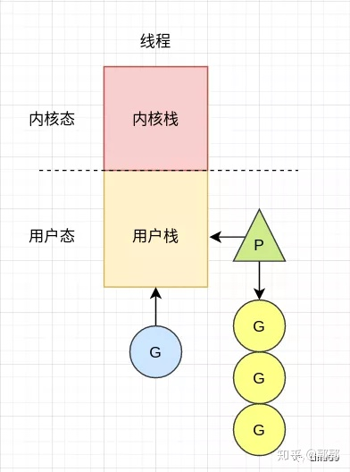
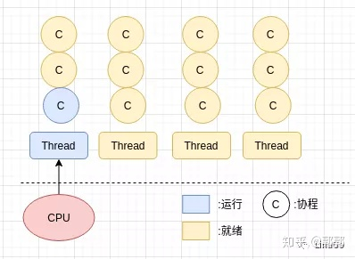

## go服务不能准确识别docker的CPU数量

### 写在前面
#### 问题起因
前段时间公司某个中台服务出现了延迟过高的问题,经过调查后发现,该服务的P数量远大于容器限制的4c,大量的CPU时间用来做找G和上下文切换,需要限制下P的数量匹配docker的计算资源量.  
公司一个同事发出了这篇文章,感觉很受用,贴出来https://mp.weixin.qq.com/s/7bjefYPhI03t9HRny42zkA.

#### 解决方法
引入uber的automaxprocs库,在init中设置了P的数量,使其和docker实际分配的资源一致.

***
接下来深入了解下.

### GMP模型
参考https://zhuanlan.zhihu.com/p/261057034.
#### 操作系统的进程和线程
从操作系统层面来讲,进程是资源分配的最小单位,线程是cpu调度的最小单位.
##### 进程
程序启动时,操作系统会给内存分配一块内存空间,程序看到的时一整块连续的内存空间,称为虚拟内存空间,实际上时一块块的内存碎片.  
这块内存空间被被划分为用户空间和内核空间,用户空间用于用户程序的执行,如果需要IO操作,就需要进入内核空间进行操作.
##### 线程
线程是进程的一个执行单位,一个进程可以包含多个线程,拥有了线程的进程才会被CPU执行,所以一个进程至少拥有一个主线程.  
多个线程共享同一进程的内存空间,线程不需要额外的虚拟内存空间,切换不需要进程切换用的切换页表、切换虚拟地址空间(进程切换消耗太大,是因为切换进程需要保存太多的寄存器、栈等,线程切换只需要切换上下文).  
可以说进程面向的主要是内存分配管理,而线程主要面向CPU调度.
##### 协程
虽然线程比较轻量,但每个线程依然占有1M左右的空间,高并发场景下非常吃机器内存.线程的创建和销毁也是很大的系统开销,因为是由内核来做的,可以用线程池来解决.  
协程是用户态的线程,比线程更轻量,操作系统对其没有感知,原因是协程处于线程的用户栈能感知的范围,是由用户创建而非操作系统创建.   

一个线程也可以有多个协程,协程和线程的关系就像线程和cpu的关系,协程是放在线程上跑的,每个协程有自己的栈空间,切换协程只用保存协程的上下文,开销比内核台的线程切换小很多.

#### 含义
* G: goroutine,每个goroutine都有自己的栈空间,初始的栈空间大小为2k左右,空间会增长.
* M: 抽象化的线程,记录内核线程栈信息,当G调度到线程上运行时,会使用G自己的栈信息.
* P: 调度器,负责调度G,维护一个本地的G队列,M从P上获取G执行,同时还负责内存的管理.
#### 模型

M是一个线程,一个G绑定在M上运行,P维护着多个G等待运行.(一个M上同一时刻只有一个G在运行,g0除外).  
增加P的目的: 通过增加本地队列减少锁操作;内存管理.

### 为何会P过多
Go启动的时候读取了宿主机的CPU核心数,例如在一台96c的物理机上,启动一台限制核心数为4c的docker,Go启动时读取的CPU数为96,而非限制的4.

### 为什么P过多会导致延迟变高
上面提到的文章里,作者做了下监测,发现P数量为96的服务相比P数量为4的findrunable函数占用时间过多,这是因为96个P都会去找G,浪费了大量的CPU时间,使得执行任务使用的CPU变少了.  
GMP是一个生产消费模型,我们的代码去生产G,由M来消费,P负责协调. 如果没有读取了宿主机的CPU数,那就是生产速率过高,消费能力太弱,在docker上的场景就是CPU受限率特别高,很多任务都在等待被调度.(CPU受限这个需要好好学一下).

### 解决方法
如何将CPU的性能用到极致,例如4核CPU.
* 如果开3个线程,那始终有一个CPU闲置.
* 如果开5个线程,那总有一个线程等待被执行,而且切换上下文,设置寄存器需要时间.
* 如果开4个线程,那不用进行切换.
go的runtime.GOMAXPROCS设为CPU数量是最好的策略,但又不能自己手动去设置,这样会将代码和运行环境耦合.  
go的getncpu是通过sysctl获取CPU核心数,读取的是/pro/cpuinfo文件,可以读取容器内的CPU限制,这样就可以根据环境来改变P的数量.这也是uber-go/automaxprocs的原理.  

### 总结
自己对于底层这方面的知识还是有很多欠缺的,需要加深学习,但引入这个限制P数量的操作应该是所有部署在docker的go服务都必备的.
