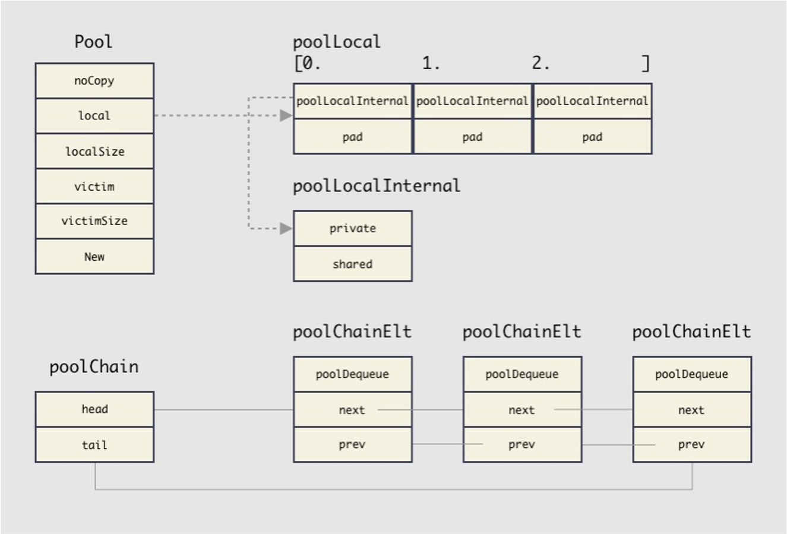
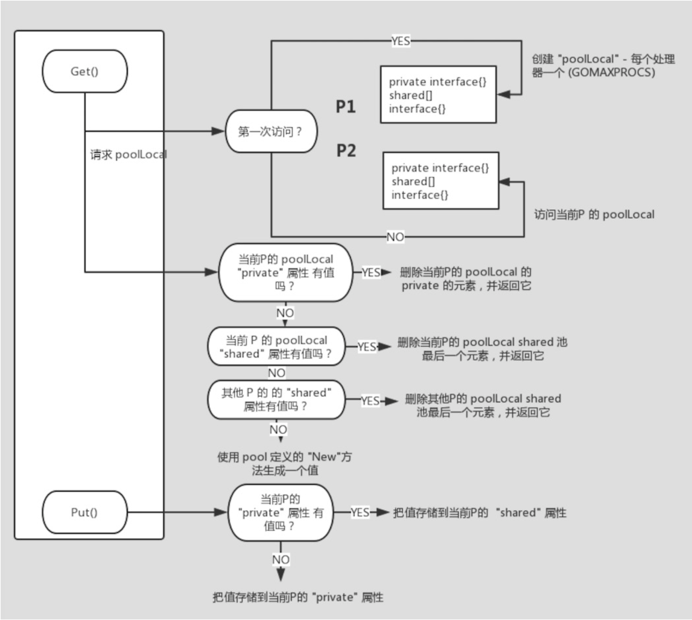

# golang 基础库sync.Pool

## 使用姿势
### 认识下sync.Pool
```golang
type Pool struct {
  ...
  New func() interface{}
}

func (p *Pool) Put(x interface{}) {
  ...
}

func (p *Pool) Get() interface{} {
  ...
}
```
sync.Pool暴露了以上三个方法,分别为构造pool时传入新建对象方法,获取pool中对象,将对象放回pool中.  
主要特点:
1. 一个放内存的池子.
2. 重复使用临时对象.
3. 减少GC压力.
4. 并发安全.

### 使用例子
```golang
var createdNum int64 // 记录创建对象次数

type Node struct {
	Value int64
}

func NewNode() interface{} {
	atomic.AddInt64(&createdNum, 1) // 保证new方法的并发安全
	return &Node{}
}

func Handle() {
	nodePool := sync.Pool{
		New: NewNode, // 传入新建对象方法
	}

	workers := 1024 // 设置并发数
	wg := sync.WaitGroup{}

	for i := 0; i < workers; i++ {
		wg.Add(1)
		go func() {
			defer wg.Done()

			node := nodePool.Get()   // 从pool中获取对象
			defer nodePool.Put(node) // 将对象放回pool

			Task(node.(*Node))
		}()
	}
	wg.Wait()
	fmt.Println(createdNum) // 输出新建对象申请内存次数
}

func Task(node *Node) {
}
```
使用注意:
1. 无法得知Get获取的对象是新的还是旧的.
2. pool不会对回收的内存进行重置,获取到需要自己memset.
3. pool中的对象随时可能被释放,完全由runtime控制.
4. pool是并发安全的,New方法会被并发调用,需要使用者保证New方法的并发安全.
5. Get/Put与new/free用法类似,但Get获取到对象后可以不使用Put放回,Put放回的也不一定必须是Get获取的元素.

## 源码剖析
### 数据结构
```golang
type Pool struct {
	noCopy noCopy

	local     unsafe.Pointer // 1.
	localSize uintptr

	victim     unsafe.Pointer  // 2.
	victimSize uintptr

	New func() interface{}
}

type poolLocal struct { // 3.
	poolLocalInternal
	pad [128 - unsafe.Sizeof(poolLocalInternal{})%128]byte // 4.
}

type poolLocalInternal struct { // 5.
	private interface{}
	shared  poolChain  
}

type poolChain struct { // 6.
	head *poolChainElt
	tail *poolChainElt
}

type poolDequeue struct { // 7.
	headTail uint64
	vals []eface
}
```
1. local和localSize实现了一个数组, 数量与GMP模型中P的数量相等, 元素类型为poolLocal, 分别对应每个P.
2. victim与local结构一致, 在gc开始前会将local里的元素拷贝到victim里, 目的是减少GC后的性能抖动.
3. 每个P会对应一个该结构.
4. 内存填充到128字节对齐, 避免false sharing.
5. 整个结构体都是当前P独有的, 但private是只有当前P可以使用,
shared是别的P也可以使用.
6. 存储缓存元素的双向链表, 类似于ringbuffer.
7. 缓存元素存储在vals里.

数据结构图


### 主要流程
```golang
func (p *Pool) Get() interface{} {
	l, pid := p.pin() // 1.
	x := l.private    // 2.
	l.private = nil

	if x == nil {
		x, _ = l.shared.popHead() // 3.
		if x == nil {
			x = p.getSlow(pid) // 4.
		}
	}

	runtime_procUnpin() // 5.
	if x == nil && p.New != nil {
		x = p.New() // 6.
	}

	return x
}

func (p *Pool) Put(x interface{}) {
	if x == nil {
		return
	}

	l, _ := p.pin() // 7.
	if l.private == nil {
		l.private = x // 8.
		x = nil
	}

	if x != nil {
		l.shared.pushHead(x) // 9.
	}
	runtime_procUnpin()
}
```
1. 将G锁定在当前M, 使M不能被抢占.
2. 第一次尝试从local的private里获取缓存元素.
3. 第二次尝试从local的shared里获取缓存元素.
4. 第三次尝试先从别的P的share里获取, 再从victim里获取.
5. 将G-M绑定解除.
6. 如果前三次都没有找到可用的缓存元素, 就创建一个.
7. G-M锁定.
8. 第一次尝试放入当前P的private里.
9. 第二次放入当前P的shared双向链表里.

### Get优先级
1. 当前P的local.private.
2. 当前P的local.shared.
3. 其他P的local.shared.
4. victim.
5. 重新构造一个.

### Put优先级
1. 当前P的local.private.
2. 当前P的local.shared.

```golang
func (p *Pool) pinSlow() (*poolLocal, int) { // 1.
	// Retry under the mutex.
	// Can not lock the mutex while pinned.
	runtime_procUnpin()
	allPoolsMu.Lock()
	defer allPoolsMu.Unlock()
	pid := runtime_procPin()
	// poolCleanup won't be called while we are pinned.
	s := p.localSize
	l := p.local
	if uintptr(pid) < s {
		return indexLocal(l, pid), pid
	}
	if p.local == nil {
		allPools = append(allPools, p) // 2.
	}
	// If GOMAXPROCS changes between GCs, we re-allocate the array and lose the old one.
	size := runtime.GOMAXPROCS(0) // 3.
	local := make([]poolLocal, size)
	atomic.StorePointer(&p.local, unsafe.Pointer(&local[0])) // store-release
	atomic.StoreUintptr(&p.localSize, uintptr(size))         // store-release
	return &local[pid], pid
}

func poolCleanup() { // 4.
	for _, p := range oldPools {
		p.victim = nil
		p.victimSize = 0 // 5.
	}

	// Move primary cache to victim cache.
	for _, p := range allPools {
		p.victim = p.local // 6.
		p.victimSize = p.localSize
		p.local = nil
		p.localSize = 0
	}

	// The pools with non-empty primary caches now have non-empty
	// victim caches and no pools have primary caches.
	oldPools, allPools = allPools, nil // 7.
}
```

1. 每个P第一次调用pool的Get时会走进这个函数.
2. 第一次调用, 将pool注册进allPools数组.
3. local数组的大小定为P的数量, 默认情况下为cpu个数.
4. 在GC前调用.
5. 清理oldPools的victim.
6. 将local拷贝到victim, 后面put的元素会全部进入local里, get会优先local, 防止GC引起抖动.
    * victim机制将回收动作由一次变为两次,每次清理都是上次cache的对象才会被真正清理掉,当前缓存的对象只是移到了回收站,仍然可以被使用.
    * 从victim里取出的元素,被使用后会放入local里.
7. 清理oldPools.


主要流程图

