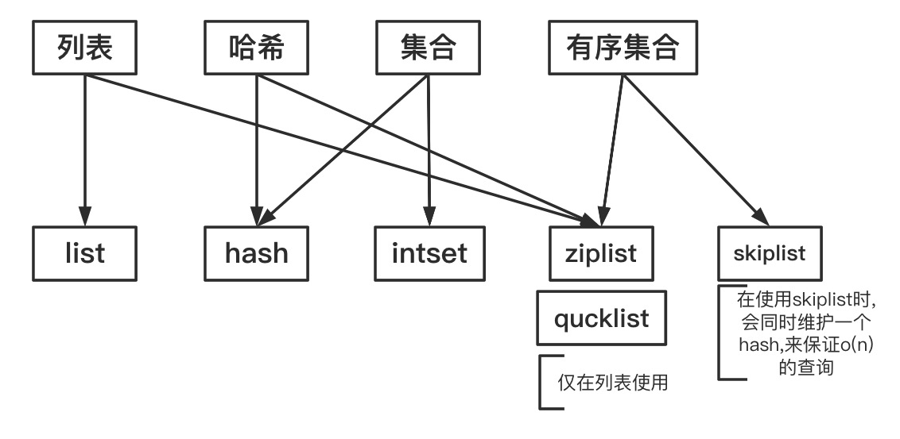

## 写在前面  
推荐书籍: 《redis设计与实现》  
推荐博客: https://www.cnblogs.com/hunternet/tag/Redis/ (其实就是复述了一遍书,可以用这个博客实现对书的检索功能)

## 数据类型
|数据类型|底层实现|
|----|----|
|列表|(linkedlist ziplist)/quicklist|
|哈希|ziplist hashtable|
|set|intset hashtable|
|sortset|ziplist skiplist&hashtable|

其中quicklist是linkedlist和ziplist的结合体,每个节点是一个ziplist,节约指针所占的空间和内存碎片化问题,在redis3.2版本以后,列表的实现方式使用quicklist代替了原本的linkedlist和ziplist.

1. 列表  
redis3.2之前,数据少使用ziplist,数据多使用linkedlist,3.2后全部使用quicklist.
2. 哈希
数据少使用ziplist,数据多使用hashtable.
3. set
数据少并且是int使用intset,数据多使用hashtable.
4. sortset
数据少使用ziplist,数据多使用skiplist&hashtable.

*todo 增加数据量划分*

数据结构图


## 命令
命令太多了,就不写了,会用就行 ^_^

## 过期时间
很多命令设置时没有过期时间,可以用**expire**来追加设置.  
* 使用expires字典保存过期时间.  
* 最多到毫秒.
* 使用惰性删除和定期删除两种策略,定期删除是每次随机取一些键进行检查,惰性删除是用到这个键时才会去删除这个键.

## 持久化
面试必考划重点

### RDB持久化  
* 将数据库状态保存为压缩的二进制文件.  
* RDB持久化的优先级低于AOF持久化,优先使用AOF来进行还原,只有在AOF关闭时,才会使用RDB持久化.  
* SAVE命令,前台存储,会阻塞所有的redis命令,进行保存.
* BGSAVE是后台保存,fork一个线程出来,只有fork的时候阻塞主线程,子线程执行SAVE的过程不影响主线程继续执行命令.
* redis自带SAVE自动保存,满足条件之一就可以：900秒一次修改,300s十次修改等. 这个条件可以通过修改redis的conf文件来更改.

### AOF持久化
* AOF是将写redis的命令记录下来,类似于mysql的binlog,而RDB是将redis整个的键值对记录下来.
* AOF记录的格式是纯文本格式,将redis写命令的**请求**记录下来.
* 使用AOF恢复redis时,会使用一个没有网络连接的伪客户端来向redis服务端发送AOF记录里的写入请求.

### AOF重写
* 当redis写入命令过多时,必然导致AOF文件的膨胀,AOF重写是将记录里一个键的多条写入命令变为一条.
* 将多条命令变为一条的过程是,直接读取库里的键值,写入AOF中.
* 重写过程在子进程中进行,会复制一份AOF文件来进行重写,同时在父进程中将写入的命令同时写入到AOF缓冲区和AOF重写缓冲区,在子进程完成重写后,会在父进程中阻塞其他命令,将AOF重写缓冲区的数据写入到新AOF文件中,再用新的AOF替换老的AOF.

## 事件
### 时间事件
* redis将所有的时间事件放在一个无序链表中,链表是越晚插入的在后面,不会根据执行时间去排序,所以每次时间执行器运行时会遍历整个链表,将运行时间在当前时间之前的执行.
* 时间事件执行器每隔100ms执行一次,遇到冲突的文件事件会优先执行文件事件.
（这个100ms可以修改）
* 时间事件并不能做到精准到毫秒去运行.

## 主从复制
### 旧版复制功能：SYNC
1. 从服务端发送SYNC命令.
2. 主服务器执行BGSAVE,在后台生成RDB文件,并在缓冲区记录生成RDB文件期间服务器的写操作.
3. 主服务器将RDB文件发送给从服务器,从服务器载入RDB,更新到主服务器开始执行RDB操作时的状态.
4. 主服务器将缓冲区的写命令发给从服务器,更新到主服务器当前状态.

### 新版复制功能：PSYNC
分为完整重同步和部分重同步
1. 完整重同步等同于旧版复制功能,用于初次复制.
2. 部分重同步用于从服务器断线重连,如果条件允许,主服务器将断开期间的写命令发送给从服务器去执行一遍,完成同步.

**redis同步的策略是优先执行增量同步**

### 增量复制偏移量
1. redis的主从服务器都会保存复制偏移量,即主服务器同步给从服务器的数据量.
2. 偏移量可以用于校对主从服务同步状态,如果某次同步从服务器丢失了同步信息,下次请求同步会从丢失的偏移量之前开始.
3. redis使用复制积压缓冲区来记录已发送的同步命令,当复制偏移量不一致时,主服务器先从缓冲区去找,找到了就将从服务器偏移量后的同步命令全部给从服务器.
4. 如果丢失命令已经不在缓冲区里,就执行全量重同步.
5. 复制积压缓冲区使用**固定长度先进先出队列**实现.

## 哨兵
* 一个或多个sentinel实例组成sentinel系统可以监视任意多个redis主服务器以及这些主服务器下属的从服务器,当一个主服务器下线,会将一个从服务器晋升为主服务器.
* 当下线的原主服务器重新上线时,sentinel会将其置为从服务器.
* sentinel是由普通的redis服务器转变状态而来,换言之,sentinel是一个redis服务器.
* 检测是否在线是sentinel每秒一次向所有实例（主从服务器,其他sentinel）发送ping命令.
* sentinel会每十秒一次向主服务器发送INFO命令,通过INFO的回复来获取主服务器的信息.

## 事务
```shell
MULTI  
set ...  
EXEC
```

### WATCH命令
是一个乐观锁,监视数据库键,当一个事务改变这些键时,服务器会直接拒绝


1. 原子性  
在批量命令入队时,如果服务器发现有个命令错误,则一条命令也不会执行.
而在命令全部入队后,如果执行命令出错,依然会执行完全部命令,不支持事务回滚.

2. 一致性  
一致是指数据符合数据库本身的定义和要求,没有非法和无效的数据.  
入队错误: redis2.6.5之前的版本,即使命令在入队过程中发生了错误,事务提交后依然会执行,只是不执行出错的命令(如get 后无参数).  
在2.6.5之后的版本,如果入队时命令出错,会直接不执行事务中的所有命令.  
执行错误: 如get 一个 list, redis会不执行这条命令.  
服务器停机: 无论是否开启持久化都会保持一致性.

3. 隔离性  
redis使用单线程运行, 事务都是串行, 所以可以保证隔离性.

4. 持久性  
仅在AOF持久化开启, 模式为always时, 即程序在执行完命令后会立即执行sync, 可以实现AOF持久化.
