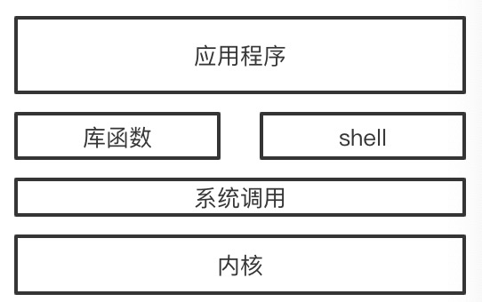

## 内核态和用户态是什么
linux架构图  

系统调用将linux分为用户态和内核态,或者说是内核空间和用户空间.  
从功能上来讲:
* 内核态: 控制计算机的硬件资源,如协调CPU资源,分配内存等.  
* 用户态: 提供应用程序运行的空间.
* 系统调用: 为了使应用程序能访问到内核管理的资源,如CPU,内存,I/O等,内核必须提供一组通用的访问接口,称为系统调用.
* 库函数: 屏蔽底层的实现细节,对系统调用进行封装.
* shell: 把内核包起来的外壳,做了和系统调用类似的事情,只是提供一个终端给用户来做交互,符合语法的文本叫shell脚本.

## 区别
| |用户态|内核态
|---|---|---|
|可访问的资源|只能访问受限的内存,不能访问外围设备,CPU能被抢占|CPU可以访问内存的所有数据,所有外围设备(硬盘,网卡),可以占用CPU,不能被抢占|
|运行的内容|运行用户程序|运行操作系统,操作硬件|
|特权级别|R3|R0|
|转换机制|转换到内核态通过中断、异常、陷入(系统调用)|转换到用户态设置状态字PSw|

## CPU特权级别
intel x86的CPU分为四个级别,0~3,0最高,3最低,linux只用了两个,0和3,内核态的程序有r0权限,用户态的只有r3权限.  
从特权的角度来讲,r3权限就是用户态,r0就是内核态.

## 用户态如何切换到内核态
* 系统调用,也叫陷入,通过系统调用申请系统服务,例如fork()新建一个进程,就会进入内核态.
* 异常.发生了某些不可预知的异常,会触发到处理该异常的内核相关程序中,进入内核态.
* 外围设备中断.外围设备完成用户请求的操作后,会向CPU发出中断信号,如果CPU之前在用户态,那此时会切换到内核态.

##
