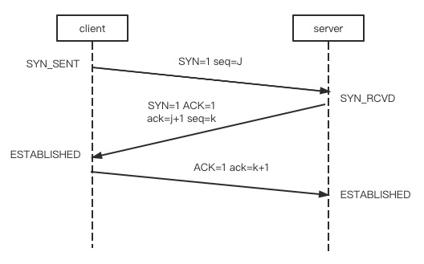
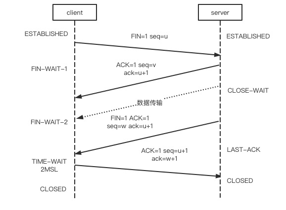

## TCP
### OSI七层模型
1. 应用层:为应用程序提供网络服务.
2. 表示层:数据格式转换、数据压缩和数据加密.
3. 会话层:建立、断开和维护通信链接.
4. 传输层:为上层协议提供端到端的可靠传输.(tcp/udp)
5. 网络层:寻址和路由.(ip/arp/rarp)
6. 数据链路层:定义通过通信媒介互连的设备之间传输的规范.
7. 物理层:利用物理传输介质.
### TCP五层模型
将应用层,表示层,会话层合并为应用层.

### 面向有连接面向无连接
1. 面向有连接过程包括会话建立、传输数据和会话断开,还有保证可靠性的超时重连、流量控制等,常见的有TCP等.
2. 面向无连接仅提供传输数据功能,没有建立连接的过程,不感知对方是否存在,常见的有UDP、IP等.

### TCP和UDP
都属于传输层协议.

1. TCP面向有连接,只有和对端建立和连接才会发送数据,还有多种措施保障传输的可靠性.
2. UDP只提供传输功能,不去保障传输的可靠性.
3. 区别:
    * TCP面向连接,UDP面向无连接.
    * TCP一对一,UDP一对多,多对一,多对多.
    * TCP面向字节流,发送方将应用层传来的报文拆成数据块,封装TCP首部;UDP面向报文,直接将应用层的报文封装UDP首部.
    * TCP会保证传输可靠性,保证包的传输顺序、重发机制、流量控制和拥塞控制.UDP仅提供基本数据传输能力.

### TCP和UDP对应的上层协议
1. TCP:
    * FTP文件传输协议.
    * SSH远程登陆协议.
    * HTTP超文本传输协议.
2. UDP:
    * DNS域名解析.
    * TFTP简单文件传输协议.
    * SNMP简单网络管理协议.

### TCP和UDP首部
#### TCP
每一行32位,占四个字节,至少5行,最小20个字节,最多60字节.  
1. 16位源端口号.16位目的端口号.
2. 32位序号.第一个序号随机生成,后面的序号是上一次的序号加上次发送的数据.
3. 32位确认号.回复时将上次的序号+1,如收到1000,那回复1001.
4. 4位头部长度.6位保留.控制位6位UGR,ACK,PSH,RST,SYN,FIN.16位窗口,流量控制.
5. 16位校验和16位紧急指针.
6. 选项部分:长度0-40字节.
#### UDP
每行32位,4个字节.两行.
1. 16位源端口号.16位目的端口号.
2. 16位UDP长度.16位UDP校验和.

### 三次握手和四次挥手
#### TCP报文首部
1. 序号seq
对字节流的编号.例如第一个字节的序号为301,本次携带数据长度为100字节,那么下一个报文段的序号应为401.第一份报文段的序号是随机生成的,随后的报文段序号是延续前一个的序号和报文长度.  
**服务端和客户端自己用自己的字节排序,不混用.**
2. 确认号ack
期望收到的下一个报文段的序号,例如B收到来自A的一个报文,序号为101,共有10字节,那B返回给A的确认报文中的确认号就为110.  
**将对方发来的seq+1,返回给对方.**
3. SYN控制位
用于建立连接,该位为1时表示希望建立,并且对第一份报文的序号进行随机初始化.
4. ACK控制位
确认应答的字段,TCP规定出了最初建立连接的SYN包以外全部必须设为1.  
**回复字段会设为1.**
5. FIN控制位
FIN为1表示发送方的数据已发送完毕,要求关闭连接.

#### 三次握手

1. 第一次握手,client将SYN置为1,表示希望建立TCP连接;序列号初始化为J,将数据包封装发给Server,client进入SYN_SENT状态,等待Server确认.
2. 第二次握手,Server将SYN置为1,表示同意建立连接;ACK设为1,表示回复;将seq随机为k;ack设为请求的seq+1,即为j+1.
3. 第三次握手,客户端收到后,校验ack是否是上次发送的seq+1,ACK是否为1,校验通过后client进入ESTABLISHED状态,并发确认码给服务端,ACK为1,ack为上次服务端发来的seq+1,即k+1;服务端校验通过后,server进入ESTABLISHED状态,随即可以进行传输数据.

#### 四次挥手

1. 第一次挥手,客户端发起断开请求,FIN为1,seq为u,客户端进入FIN_WAIT_1.
2. 第二次挥手,服务端收到请求断开,立即回复确认收到,ACK为1,ack为u+1,seq为v.
3. 第三次挥手,客户端收到后进入FIN_WAIT_2状态.当服务端剩余数据发送完后,此时seq轮到w(*因为这段区间内服务端发送了数据给客户端,假设发送数据为x,则w=v+x*),FIN置为1,表示服务端可以断开连接,ACK为1,ack为u+1,随即服务端进入LAST-ACK,等待客户端确认回复.
4. 第四次挥手,客户端收到后,回复确认报文,ACK为1,ack为服务端传来的w+1,seq为之前发送的u+1,发送后客户端进入最后的TIME-WAIT状态,经过2MSL(*最长报文段寿命*)后,客户端进入CLOSED状态,关闭连接;而服务端在收到客户端的回复后,立即进入CLOSED状态.

#### 为什么要三次握手
三次握手和四次挥手本质上都是客户端和服务器都必须有一次完整的请求和回复,如果把三次握手最后一次握手去掉,那服务端就没有收到客户端的回复,如果客户端发送的第一个连接请求在网络中阻塞,客户端又发送了第二个连接与服务端成功完成请求,阻塞的第一次请求到达服务端后,服务端又以为客户端需要建立连接,如果没有最后一次的确认,就会浪费服务器的资源.

#### TIME-WAIT&2*MSL
客户端第四次挥手,发送回执后等待2*MSL才进入CLOSED状态.原因有两个:
1. 客户端发给服务端的回执可能会丢失,如果丢失了,即服务端在1MSL的时间里没有收到回执,则服务端会再次发送FIN=1的请求,客户端会再次发送回执.如果没有2*MSL的等待,服务端收不到回执再次发送的ACK不会被client收到,服务端无法进入CLOSED状态.
2. 等待时间是为了本连接产生的所有报文从网络中消息,使其不会出现在下一次连接中.

#### 为什么是四次挥手而不是三次
1. 第二次和第三次都是服务器向客户端发送报文,第二次是服务给客户端反馈收到了关闭请求,服务端仍可能有数据需要发送给客户端,在数据发完后,再向客户端再次发送断开请求.
2. 如果是三次,将服务端发送的两次合起来,会使得服务端无法传输全部数据给客户端.

### ARQ协议
自动重传请求(Automatic Repeat-reQuest),TCP协议中使用.  
如果发送方一段时间内没有收到确认回执,会重新发送.

### TCP的流量控制
控制发送方发送数据的速率,保证接收端能接收成功,否则一直触发超时重传浪费网络流量.  
流量控制使用滑动窗口,接收方会通知发送方自己的接收能力,称为窗口的大小,TCP首部中有一个字段会表示窗口大小.

### TCP的拥塞控制
如果在通信开始就立即将大量的数据注入到网络中,会引起网络阻塞.  
拥塞控制策略有慢启动、拥塞避免、快重传和快恢复.  
#### 慢启动
通信开始时会有一个拥塞窗口,从1开始逐渐增大,每收到一个回执就加一(逐渐增加窗口大小).发送端在发送数据时,数据量会小于拥塞窗口的大小(同时也会比较流量控制的滑动窗口,也会小于这个值).
### TCP粘包
如果客户端不断向服务器发送数据包,服务端收到数据包出现两个数据包粘在一起,就是粘包.
出现原因:
1. TCP是基于字节流的,虽然应用层给TCP传输层的是大小不等的数据块,但TCP把这些数据堪称一连串无结构的字节流,没有边界.
2. TCP的首部没有表示数据长度的字段.

#### 粘包的产生
1. 发送方粘包  
TCP的客户端和服务端会保持一个长连接状态,如果发送的数据包过小,那么TCP会采用nagle算法,将数据包进行合并发送,合并过程在发送缓冲区进行,数据发过来就已经是粘包的状态了.(发送方TCP将多次写入缓冲区的数据一次发送出去,将会产生粘包).
2. 接收方粘包
数据到接收方,传递到传输层,传输层的TCP将其放置到接收缓冲区,由应用层主动获取.当应用层不能及时读取,下一个数据又写入缓冲区,应用层读取数据时就是粘包.(接收方未及时读取,就会产生粘包).

#### 避免粘包(拆包)
每个包的末尾加上特殊自负,区分连续的两个包.  
报文首部添加包的长度.

## HTTP
### HTTP和HTTPS
http是应用层协议,超文本传输协议,将信息以http报文的形式传输.  
https比http多加密、认证、完整性保护.   
http缺点:明文可能被窃听;无法认证双方身份,可能被伪装;无法验证报文完整性.  
https改进:
1. 加密.通过SSL和TLS协议将报文加密(SSL/TLS运行在TCP上,HTTPS运行在SSL/TLS上).
2. 认证.通过第三方机构颁布证书,确认双方身份.客户端请求需带上完整证书,客户端通信钱查看服务端证书.
3. 完整性保护.通过MD5等散列码进行通信内容校验.

### 无状态协议
无状态协议指对通信状态不保存,不做持久化处理.  
为了解决无状态的问题,引入cookie,cookie写在请求和响应报文中.服务端发送响应报文中填充Set-Cookie字段去通知客户端保存cookie.客户端再次发送请求时,会将cookie放在请求报文中发送,服务端比对后得到之前的状态信息.
#### cookie/session/token
1. cookie是服务器下发,保存在浏览器的一个文件里,浏览器下次请求会带上cookie.
2. session是服务器为所有用户存储身份标识,用户使用下发的身份标识去请求,服务器从存储的session中去校验,用户离开时会删除,很浪费服务器资源.
3. token将用户的数据用加密算法使用特殊密钥做一个签名,将数据和加密后的签名下发给用户,用户下次请求时带上这个token,服务端使用加密算法去校验数据和签名是否匹配.这样可以节省服务器资源.

*[参考链接](https://www.cnblogs.com/moyand/p/9047978.html)*

### URI和URL
URI:统一资源标识符(uniform resource identifier),标识互联网中的一份资源.  
URL:统一资源定位符,访问的网址为URL.
URL是URI的子集.URI相当于抽象类,URL是这个抽象类的具体实现.

### HTTP动作
GET,PSOT,PUT,DELETE,HEAD,OPTIONAL
#### PUT和POST区别
put是幂等的,post非幂等.
#### GET和POST区别
1. GET在浏览器回退时不会再次请求,而POST会再次请求.
2. GET会被浏览器主动cache,POST不会.
3. GET的请求参数会保存在浏览器历史里,POST不会.
4. GET传递的参数有限制,POST没有限制.
5. GET比POST更不安全,参数暴露在url中.
6. GET的参数在URL中,POST在body里.
7. 一般情况下,GET会发送一次请求,POST会发送两次请求.

### HTTP返回码
* 200:请求正常处理.
* 204:请求受理但没有资源可以返回.
* 206:客户端只是请求资源的一部分,服务端只对请求的部分资源执行GET方法,报文中通过content-range指定范围的资源.
* 301:永久重定向.
* 302:临时重定向.
* 303:与302状态码有相似功能,只是它希望客户端在请求一个URI的时候，能通过GET方法重定向到另一个URI上.
* 304:客户端请求附带条件,条件不满足时返回,与重定向无关.
* 307:临时重定向,与302类型,只是强制使用POST方法.
* 400:请求语法有错误.
* 401:请求需要认证.
* 403:请求被禁止访问.
* 404:服务器无法找到资源.
* 500:服务器内部错误.
* 502:bad gateway.
* 503:服务器忙.

### HTTP1.1&2.0
* 1.1新特性:  
长连接(一个TCP上可以有多个HTTP,默认开启keep-alive),请求管道化,增加缓存处理,增加host字段(多个域名绑定到一个服务器上,可以用host去区分),支持断点传输.
* 2.0新特性:  
二进制(1.x是文本),多路复用连接共享(一个TCP连接同时可以做多个HTTP请求),头部压缩(解决1.x中header很大需要重复传输的问题,通信双方缓存一份header fields表),服务器推送(服务端可以推送数据给客户端).
* 多路复用和长连接  
使用长连接以前,一个HTTP请求需要单独建立一个TCP连接,使用长连接后,多个http可以在同一个tcp上进行,不过会排队.  
多路复用是多个http请求可以并行执行,某个任务耗时严重不会影响其他连接.  
多路复用主要是低延迟,TCP连接会慢启动,逐渐增加窗口,导致一开始的连接速度比较慢,多路复用直接用一个连接,让具有突发性和时效性的HTTP连接可以直接满速.

### 长连接
#### HTTP长连接
本质上是TCP的长连接,1.1之前,http一次请求结束后会断开TCP,http在1.1后默认使用长连接,多个http请求可以在一个TCP连接上,一个请求结束后不断开.

#### TCP长连接
TCP长连接是完成一次请求后,不断开TCP连接,一方会发送心跳包给另一方,检测连接可用,长连接可以避免短时间内多次请求重复TCP三次握手四次挥手的性能损耗.

### 输入一个URL发生了什么
1. URL解析.  
首先判断是一个url还是一个待搜索的关键词,如果是关键词直接调用搜索引擎.
2. DNS查询.
查询域名对应的ip地址,顺序依次为浏览器缓存-操作系统缓存-路由器缓存-isp(客户端电脑上设置的首选DNS服务器)DNS缓存-根域名服务器查询.拿到服务器的ip.
3. TCP连接
* 应用层:构造http报文,浏览器只能发送get和post,打卡网页使用的是get.
* 传输层:TCP传输报文,建立一条到服务器的TCP连接,为方便传输会对数据进行分割,并标记编号,三次握手建立连接.
* 网络层:ip协议查看mac地址,判断目标地址与当前地址是否在同一网络中,如果在直接根据mac地址发送,否则使用路由表查询下一跳地址,以及使用ARP协议查询他的mac地址.
* 数据链路层:以太网协议,网卡.
* 物理层:
4. 服务器处理请求.
5. 浏览器接受响应.  
根据状态码做不同的事,解析响应内容.
6. 渲染页面.

### HTTPS的过程
1. 客户端向服务器发送请求,告知支持的hash算法.
2. 服务端向客户端回复,告知证书,加密方法,同时给一个公钥给客户端,私钥由服务器持有.
3. 客户端验证证书合法性(证书中地址与访问地址是否一致,证书是否过期).
4. 客户端生成随机的对称密钥并用公钥加密,发送给服务端.
5. 服务端使用公钥解密出对称密钥,后面的通信都用这个对称加密的密钥.
#### 为什么不用公钥直接传输
公钥加密慢.
